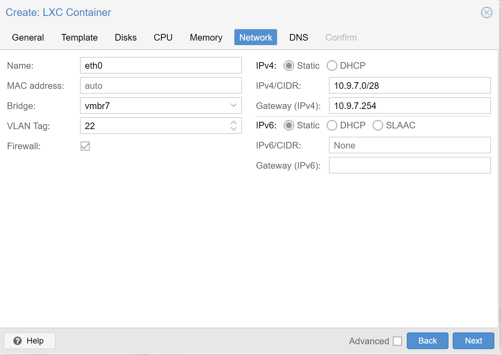

= Dokumentation - NWT Subnetze Projekt

==== Autor: Nico Wakolbinger, Mattias Wolfslehner

== Container
CT ID:

* CT 7260
** Hostname: 3ahitm-wolfslehner-wakolbinger-glue
* CT 7261
** Hostname: 3ahitm-wolfslehner-wakolbinger-01
* CT 7262
** Hostname: 3ahitm-wolfslehner-wakolbinger-02
* CT 7263
** Hostname: 3ahitm-wolfslehner-wakolbinger-03
* CT 7264
** Hostname: 3ahitm-wolfslehner-wakolbinger-04
* CT 7265
** Hostname: 3ahitm-wolfslehner-wakolbinger-05
* CT 7267
** Hostname: 3ahitm-wolfslehner-wakolbinger-06

Hostname: 3ahitm-wolfslehner

Password: WakWolfProjekt

* VM in Proxmox erstellen (Punkt 2) -> iso image von Ubuntu

* gateway (Container oder VM)
** https://ikus-soft.com/en_CA/blog/techies-10/proxmox-ve-performance-of-kvm-vs-lxc-75[Vergleich KVM und LXC^]
** Container sind in der Regel leichtgewichtiger als VMs, da sie den Kernel des Host-Betriebssystems nutzen und somit weniger Ressourcen benötigen. Container können auch schneller starten und stoppen und sind einfacher zu verwalten. Wenn der Gateway-Server beispielsweise nur eine begrenzte Anzahl von Diensten bereitstellen soll, kann ein Container eine gute Wahl sein.

VMs bieten eine höhere Isolation und können mehrere Betriebssysteme ausführen, was eine höhere Flexibilität bei der Konfiguration des Gateway-Servers ermöglicht. Wenn der Gateway-Server beispielsweise komplexere Anforderungen hat, wie z.B. die Notwendigkeit, verschiedene Betriebssysteme auszuführen oder Hardware-Virtualisierung zu nutzen, kann eine VM eine bessere Wahl sein.

Letztendlich hängt die Wahl zwischen Container oder VM als Gateway-Server von den spezifischen Anforderungen und Vorlieben des Benutzers ab. Es ist wichtig zu beachten, dass beide Optionen in der Lage sind, eine gute Leistung als Gateway-Server zu liefern.

* gateway zum www 254

