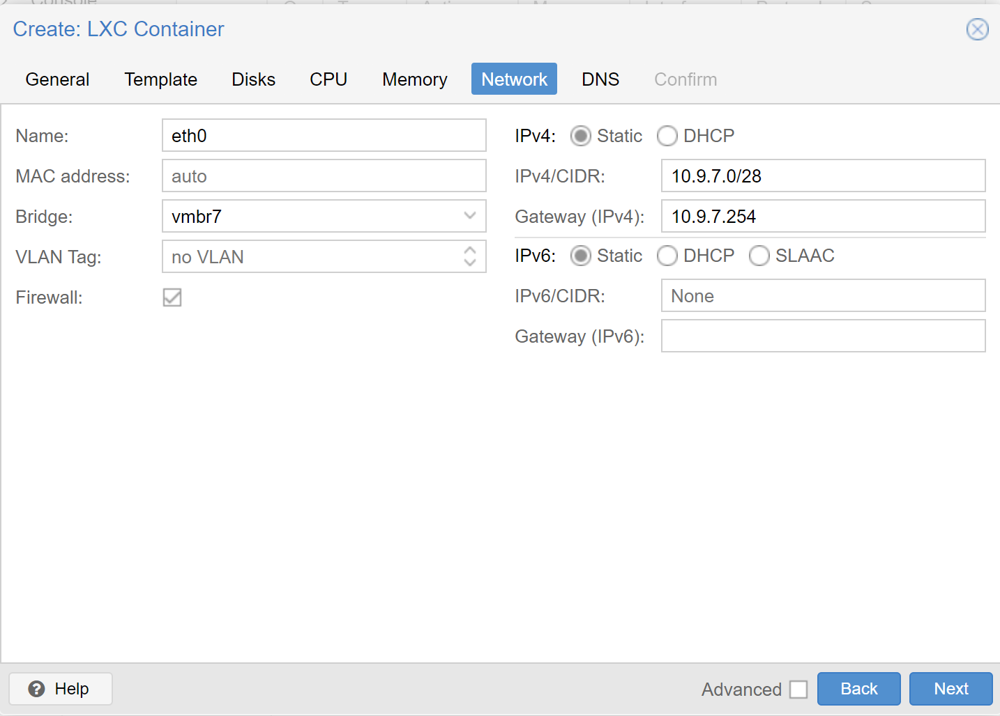

= Dokumentation - NWT Subnetze Projekt

==== Autor: Nico Wakolbinger, Mattias Wolfslehner

== Container
CT ID:

* CT 7260
** Hostname: 3ahitm-wolfslehner-wakolbinger-glue
* CT 7261
** Hostname: 3ahitm-wolfslehner-wakolbinger-01
* CT 7262
** Hostname: 3ahitm-wolfslehner-wakolbinger-02
* CT 7263
** Hostname: 3ahitm-wolfslehner-wakolbinger-03
* CT 7264
** Hostname: 3ahitm-wolfslehner-wakolbinger-04
* CT 7265
** Hostname: 3ahitm-wolfslehner-wakolbinger-05
* CT 7267
** Hostname: 3ahitm-wolfslehner-wakolbinger-06

Hostname: 3ahitm-wolfslehner

Password: WakWolfProjekt

